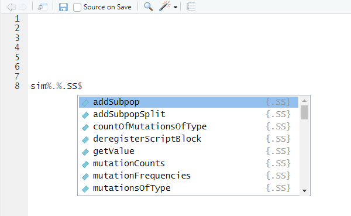
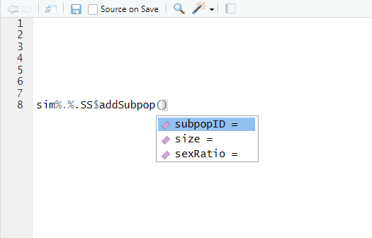

```{r, include = FALSE}
knitr::opts_chunk$set(
  collapse = TRUE,
  comment = "#>"
)

```

```{r color, echo = FALSE, results='asis'}
# crayon needs to be explicitly activated in Rmd
options(crayon.enabled = TRUE)
# Hooks needs to be set to deal with outputs
# thanks to fansi logic
if(requireNamespace("fansi", quietly = TRUE)) {
  old_hooks <- fansi::set_knit_hooks(knitr::knit_hooks, 
                                     which = c("output", "message", "error"))
}
```

This vignette introduces the `slimrlang` package. `slimrlang` has the goal of making it easy to write scripts for the population genetics simulation software and programming language [SLiM](https://messerlab.org/slim/). In addition `slimrlang` offers tools to get R objects and generated model parameters into SLiM, as well as to help SLiM generate R friendly output for post-simulation analysis. 

`slimrlang` works best in conjunction with the [`slimr`](https://github.com/rdinnager/slimr) package, which imports `slimrlang` and provides tools with working with existing SLiM scripts as well as running, monitoring, and visualising SLiM simulations in realtime and directly from R, as well as post-processing in R.

To write a SLiM script in `slimrlang` you must wrap your SLiM code in `slim_block` function calls, which are then nested in a `slim_script` function call. The API for `slimrlang` has been designed to mimic as close as possible the way that scripts are written in SLiM itself. To get you started we will use an example. SLiM has an extremely extensive manual that includes a large number (around 150!) of example scripts to help users learn the language. We will take advantage of this resource and try to write a few of the manual's scripts using the `slimrlang` approach.

This is the first SLiM script (referred to as 'recipes') in the SLiM manual:

```
// set up a simple neutral simulation
initialize()
{
  // set the overall mutation rate
  initializeMutationRate(1e-7);
  // m1 mutation type: neutral
  initializeMutationType("m1", 0.5, "f", 0.0);
  // g1 genomic element type: uses m1 for all mutations
  initializeGenomicElementType("g1", m1, 1.0);
  // uniform chromosome of length 100 kb
  initializeGenomicElement(g1, 0, 99999);
  // uniform recombination along the chromosome
  initializeRecombinationRate(1e-8);
}
// create a population of 500 individuals
1
{
  sim.addSubpop("p1", 500);
}
// run to generation 10000
10000
{
  sim.simulationFinished();
}
```

So how would we write this script in `slimrlang`? Like this:

```{r first_script}
library(slimrlang)

slim_script(
  slim_block(initialize(),
             {
               ## set the overall mutation rate
               initializeMutationRate(1e-7); 
               ## m1 mutation type: neutral
               initializeMutationType("m1", 0.5, "f", 0.0);
               ## g1 genomic element type: uses m1 for all mutations
               initializeGenomicElementType("g1", m1, 1.0);
               ## uniform chromosome of length 100 kb
               initializeGenomicElement(g1, 0, 99999);
               ## uniform recombination along the chromosome
               initializeRecombinationRate(1e-8);
             }),
  slim_block(1,
             {
               sim.addSubpop("p1", 500);
             }),
  slim_block(10000,
             {
               sim.simulationFinished();
             })
) -> script_1

script_1
```

It is as simple as that at its most basic. `slim_script` returns a `slim_script` object which has a print method that prints out the final SLiM script in a pretty fashion. You can see that the output above is quite similar to the original SLiM code from the manual recipe. The one difference is the block names, highlighted in cyan. These are added internally by `slimrlang` to keep track of code blocks. These names can be used in some `slimr` functions, for example, to refer to particular code blocks for modification. You can also add block 'ids' inside of SLiM code, which can be referred to within SLiM code. These are also fully supported by `slimrlang` and are kept track of alongside the `slimrlang` code block names. More on this later.

The SLiM language is similar enough to R that most of it works out of the box without any modification. However, there are a few places that SLiM is different enough that `slimrlang` has had to put in some slight modifications. We will learn about these differences throughout this vignette. At the moment however, let's go through the typical structure of a SLiM script and the `slimrlang` version of it. 

Now, the script above is just the simplest way to write a SLiM script in R, which is mostly just verbatim using the SLiM language syntax. However, if you write your script this way, you will have to be very familiar with the SLiM language, something which I personally am not yet. In order to make it easier to write SLiM scripts in R, `slimrlang` offers real-time code completion and SLiM function documentation. In order to make this work within R however, you will need to code your SLiM scripts slightly differently. This is a consequence of the object-oriented approach of SLiM, which makes heavy use of classes, methods and properties. Because R does not know the classes of object which will only be determined after the script is run within SLiM, you, the user, must specify what class an object is in order for R to know what functions and properties are available to that class, to enable autocompletion. To do this you can make use of the special operator `%.%`, which mimics the `.` operator within SLiM. SLiM, like Python, uses the `.` operator to specify that a method or property after the `.` belongs to the object before the `.`. It plays a similar role to that of `$` in R. An example of this in the above script is these lines:

```
sim.addSubpop("p1", 500);
```

and

```
sim.simulationFinished()
```

In SLiM, `sim` is a global object of class `SLiMSim`, which has a number of methods and properties associated with it. You can rewrite the above statements in `slimrlang` in the following way, which will then allow you to use autocompletion:

```{r slimrlang_version1, eval=FALSE}

sim%.%SLiMSim$addSubpop("p1", 500);

```

and

```{r slimrlang_version2, eval=FALSE}

sim%.%SLiMSim$simulationFinished();

```

Simply replace the `.` with `%.%`, then specify the class of object, in this case `SLiMSim`, followed by the `$` operator for R. The `SLiMSim` object contains all the available methods and properties for its class. There is a similar object for all SLiM classes. Note also that all SLiM class objects in `slimrlang` have an abbreviated alias to save typing. For `SLiMSim` this is `.SS`, so you could type instead `sim%.%.SS$simulationFinished();` for example. Using this way of coding let's you use autocomplete. Try typing just `sim%.%.SS` for example and (if using RStudio) you should see this:



The popup gives you a list of all methods (and properties further down) of the class. If you begin typing this list will be narrowed down further. Once you've chosen a method to use, you can press the `tab` key to bring up the arguments that the method accepts, like this:



To get help on this method, including full descriptions of the arguments, in RStudio, place you cursor over the function text and press the `F1` key. You can also simply run the function with no arguments or type `?.SS$addSubpop` or `help(".SS$addSubPop")`, all of which will bring up the documentation for this SLiM function.

```{r printr, echo=FALSE, results='hide', warning=FALSE, message=FALSE}
require(printr, quietly = TRUE)
```

```{r get_help, message=FALSE, warning=FALSE}
help(".SS$addSubpop")
```

There is also two special classes which are not actually classes in SLiM iteself, but they are used in `slimrlang` to keep particular types of SLiM function together. These are `Initialize` (or `.Init`) and `SLiMBuiltin` (or `.SB`). The `Initialize` object contains SLiM functions that can only be used in the `initialize()` block of SLiM code (more on this later). `SLiMBuiltin` contains miscellaneous functions built in to SLiM which are not part of any SLiM class. 

Admittedly, using these extra R obhects in the code does make it look somewhat less elegant, and also makes it no longer directly valid SLiM code. But don't worry, `slimrlang` knows how to transform this syntax back into proper SLiM code, which you can see by printing out the resulting `slim_script` object.

```{r print_slim_again}
slim_script(
  slim_block(initialize(),
             {
               ## set the overall mutation rate
               .Init$initializeMutationRate(1e-7); 
               ## m1 mutation type: neutral
               .Init$initializeMutationType("m1", 0.5, "f", 0.0);
               ## g1 genomic element type: uses m1 for all mutations
               .Init$initializeGenomicElementType("g1", m1, 1.0);
               ## uniform chromosome of length 100 kb
               .Init$initializeGenomicElement(g1, 0, 99999);
               ## uniform recombination along the chromosome
               .Init$initializeRecombinationRate(1e-8);
             }),
  slim_block(1,
             {
               sim%.%.SS$addSubpop("p1", 500);
             }),
  slim_block(10000,
             {
               sim%.%.SS$simulationFinished();
             })
) -> script_2

script_2
```

Okay, next up, let's see some of the neat stuff we can do to manipulate these SLiM scripts in R. First, we will see how to use R to fill in parts of the SLiM script with data from R. This is accomplished using the `slimr_template` function, which can be used to insert R generated data into a SLiM script. This is the simplest to get a SLiM script which has elements that can be filled in later with a templating mechanism. So, how does that work? Well, anywhere we want something in the SLiM script to be 'in-fillable', that is, to contain a variable section of the script that we can subsitute data into later, you can use the `slimr_template` function in place of what was formerly a hard-coded value. Here is an example using the same recipe as above, but in this case we want to be able to fill-in the genome size and the muation rate later:

```{r fillin_demo}
slim_script(
  slim_block(initialize(),
             {
               ## set the overall mutation rate (default = 1e-7)
               initializeMutationRate( slimr_template("mut_rate", 1e-7) ); 
               ## m1 mutation type: neutral
               initializeMutationType("m1", 0.5, "f", 0.0);
               ## g1 genomic element type: uses m1 for all mutations
               initializeGenomicElementType("g1", m1, 1.0);
               ## uniform chromosome of length "genome_size" (default = 99999)
               initializeGenomicElement(g1, 0, slimr_template("genome_size", 99999) );
               ## uniform recombination along the chromosome
               initializeRecombinationRate(1e-8);
             }),
  slim_block(1,
             {
               sim.addSubpop("p1", 500);
             }),
  slim_block(10000,
             {
               sim.simulationFinished();
             })
) -> script_temp

script_temp

```

The first argument to `slimr_template` provides a name for the variable that will later be used to label values for replacement. The second argument provides a default value. Anytime this script is used without providing values for the templated variables, the default values will be used. This argument is optional, and if not provided, an error will be thrown if any variables have no values provided when later using this script. 
